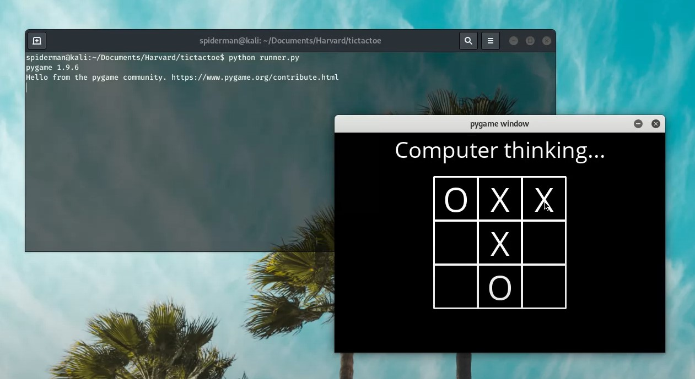

# Tic Tac Toe 

A game in which two players alternately put Xs and Os in compartments of a figure formed by two vertical lines crossing two horizontal lines and each tries to get a row of three X's or three O's before the opponent does. Implemented using Artificial Intelligence based on Minimax algorithm.

<p align="center">
	</img>
</p>

## Introduction

To solve games using AI, we will introduce the concept of a game tree followed by minimax algorithm. The different states of the game are represented by nodes in the game tree, very similar to the above planning problems. The idea is just slightly different. In the game tree, the nodes are arranged in levels that correspond to each player's turns in the game so that the “root” node of the tree (usually depicted at the top of the diagram) is the beginning position in the game. In tic-tac-toe, this would be the empty grid with no Xs or Os played yet. Under root, on the second level, there are the possible states that can result from the first player’s moves, be it X or O. We call these nodes the “children” of the root node.

Each node on the second level, would further have as its children nodes the states that can be reached from it by the opposing player's moves. This is continued, level by level, until reaching states where the game is over. In tic-tac-toe, this means that either one of the players gets a line of three and wins, or the board is full and the game ends in a tie.


## What is Minimax?

Minimax is a artificial intelligence applied in two player games, such as tic-tac-toe, checkers, chess and go. This games are known as zero-sum games, because in a mathematical representation: one player wins (+1) and other player loses (-1) or both of anyone not to win (0).

## How does it works?

The algorithm search, recursively, the best move that leads the *Max* player to win or not lose (draw). It consider the current state of the game and the available moves at that state, then for each valid move it plays (alternating *min* and *max*) until it finds a terminal state (win, draw or lose).

## Understanding the Algorithm

The algorithm was studied by the book Algorithms in a Nutshell (George Heineman; Gary Pollice; Stanley Selkow, 2009). Pseudocode (adapted):

```
minimax(state, depth, player)

	if (player = max) then
		best = [null, -infinity]
	else
		best = [null, +infinity]

	if (depth = 0 or gameover) then
		score = evaluate this state for player
		return [null, score]

	for each valid move m for player in state s do
		execute move m on s
		[move, score] = minimax(s, depth - 1, -player)
		undo move m on s

		if (player = max) then
			if score > best.score then best = [move, score]
		else
			if score < best.score then best = [move, score]

	return best
end
```
Where,

* **state**: the current board in tic-tac-toe (node)
* **depth**: index of the node in the game tree
* **player**: may be a *MAX* player or *MIN* player


The Python implementation of initial state, i.e. the initial state of the board. First of all, consider it:

```python
def initial_state():

    return [[EMPTY, EMPTY, EMPTY],
            [EMPTY, EMPTY, EMPTY],
            [EMPTY, EMPTY, EMPTY]]
```
Both players start with your worst score. If player is MAX, its score is -infinity. Else if player is MIN, its score is +infinity. **Note:** *infinity* is an alias for inf (from math module, in Python).

```python
if player(board) == X: 
        value = -math.inf

elseif player(board) == o:                           
        value = math.inf
```
If the depth is equal zero, then the board hasn't new empty cells to play. Or, if a player wins, then the game ended for MAX or MIN. So the score for that state will be returned.

```python
def utility(board):
    
    if winner(board) == 'X':
        return 1
    
    elif winner(board) == 'O':
        return -1
    
    else:
        return 0
```
* If MAX won: return +1
* If MIN won: return -1
* Else: return 0 (draw)

The action function will take the board as input and returns set of all possible actions (i, j) that are available on the board for the player to place his/her marker on.

```python
def actions(board):

    possible_actions = []

    for i in range(3):
        for j in range(3):
            if board[i][j] == EMPTY:
                possible_actions.append((i,j))
                
    return possible_actions
```

For MAX player, a bigger score will be received. For a MIN player, a lower score will be received. And in the end, the best move is returned. It will loop through all the possible actions to find the optimal action and take it. Final algorithm:

```python
def minimax(board):

    if terminal(board):     
        return None

    move = None

    alpha = -math.inf
    beta = math.inf

    if player(board) == X:  
        value = -math.inf

        for action in actions(board):
            updated_value = minmax_values(result(board, action),alpha, beta, O)

            alpha = max(value, updated_value)

            if updated_value > value:
                
                value = updated_value
                move = action

    else:                     
        value = math.inf

        for action in actions(board):
            updated_value = minmax_values(result(board, action),alpha, beta, X)

            beta = min(value, updated_value)

            if updated_value < value:
                
                value = updated_value
                move = action

    return move
```